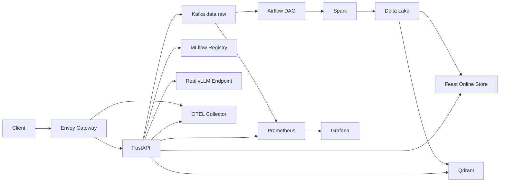

# Lab 28 Answers

## Submission status

The local lab work is complete for the CPU/local-standard path. The repository
passes the unit/static checks, the full Compose profile starts successfully, and
the non-GPU/non-LangSmith integration suite passes.

Verified locally:

- Python 3.11 environment via `uv`.
- `starter-tests` and `tests`: 87 passed.
- `ruff check .`: passed.
- `scripts/verify_matrix.py`: passed.
- `scripts/check_portability.py`: passed.
- `scripts/validate_manifests.py`: passed.
- Full Docker profile: Kafka, API, gateway, Airflow, Spark Connect, Feast,
  Qdrant, MLflow, Prometheus, Grafana, Jaeger and OTEL collector healthy.
- J1 golden path: 12 passed, 3 skipped by the vLLM GPU gate.
- J2 idempotent replay: 9 passed.
- J3 promotion/rollback: 6 passed, 3 skipped by the vLLM GPU gate.
- J4 degraded/recovery: 9 passed, 4 skipped by the vLLM GPU gate.
- J5 trace/metrics continuity: 9 passed, 1 skipped by the vLLM GPU gate.
- Integration suite with `-m "not gpu and not langsmith"`: 56 passed.
- Delta evidence: feedback table version 4 with 27 rows; documents table
  version 5 with 29 rows.
- Qdrant evidence: 29 points.
- MLflow release: `lab28-rag-release` version 3 promoted as `champion`.
- Gateway rate limiting and recovery evidence collected from the live gateway.
- Kafka consume evidence collected from `data.raw` with trace and idempotency
  headers.
- Prometheus and Grafana evidence collected from the live observability stack.
- Local Jaeger trace evidence collected for the required gateway/API/Kafka/
  Airflow/Spark spans.

Not fully verified on this machine:

- Real vLLM GPU endpoint: no verifiable vLLM endpoint was configured. The
  generated `ip07-vllm-identity.json` records this honestly as not ready.
- LangSmith export: no credential was supplied, so this remains unverified.

## Architecture and Ownership

Ownership:

- Ingestion and orchestration: IP01-IP02, Kafka topics, retries, DLQ and replay.
- Data and ML: IP03-IP04-IP06, Delta merge contract, Feast feature request,
  MLflow release and rollback.
- Serving and retrieval: IP05-IP07, Qdrant stable IDs, RAG orchestration and
  real vLLM verification.
- Platform and observability: IP08-IP10, gateway policy, readiness, Prometheus,
  Grafana and trace continuity.

## Technical Choices and Trade-offs

- Kafka headers keep `traceparent` optional but preserve `idempotency-key` on
  every event. This keeps trace continuity when a caller supplies W3C context
  without creating invalid empty trace headers.
- Delta merge input is deduplicated before Spark receives it. This prevents a
  Delta MERGE source with duplicate `idempotency_key` values from failing or
  appending replayed records.
- Feast request construction uses `FEATURE_REFS` from `contracts.py`, so the API
  and feature registry share one source of truth.
- Readiness distinguishes mandatory failures from optional degradation. This
  makes `/ready` useful for routing decisions while still exposing partial
  platform failures during demo and operations.

## Production Gaps

- Full data-plane proof still needs Airflow/Spark to complete a Delta MERGE and
  produce `ip02-airflow-run.json`, `ip03-delta-history.json` and
  `ip04-feast-online.json`.
- vLLM must be connected to a real GPU-backed endpoint and verified through
  `/version`, `/v1/models` and `vllm:` metrics. A mock endpoint should not be
  counted for IP07.
- Load results must be collected with hardware, concurrency, warm-up, P50, P95,
  P99, saturation and error rate.
- LangSmith should be marked `UNVERIFIED` unless `LANGSMITH_API_KEY` is provided
  and the collector export leg is observed.
- Secrets, runtime DBs, caches, model weights and `.lab28/` must not be
  committed.

## Contribution

Individual work in this repository:

- Completed the four required student-owned integration functions:
  `event_headers`, `dedupe_latest`, `feast_online_request` and
  `readiness_status`.
- Ran the fast unit/static checks, full Compose stack and non-GPU/non-LangSmith
  live integration suite.
- Generated available local evidence from the live core stack without faking
  unavailable vLLM or LangSmith proof.
